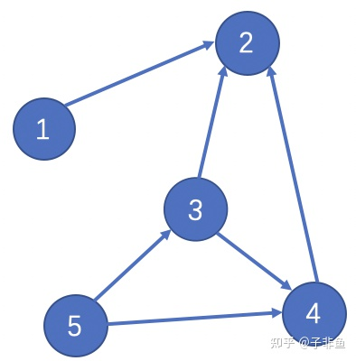

# 倒排索引
## 由来
没有搜索引擎的时候，直接输入网址获取网站内容`document => to => words`通过文章获取里面的单词，*正向索引*
后来我们希望能够输入一个单词，找到含有这个单词或者和这个单词有联系的文章`word => to => documents`*反向索引*

## 结构

增加左边一层*字典树*存储前缀，找到对应单词，然后对应到单词下的文章列表/文档ID数组

## Frame of Reference
痛点
  - 如何压缩以节省磁盘空间
  - 如何快速求交并集

### 压缩
尽量降低每个数据占用的空间，同时又能让信息不失真，能够还原回来
例如数据`[73, 300, 302, 332, 343, 372]`
1. Delta-encode增量编码
   只记录增量`[73, 227, 2, 30, 11, 29]`
2. Split into blocks分割成块
   Lucene中每个块是256文档的ID，这样保证增量编码后每个元素不会超过1byte
   这里假设每个块3个文档ID
   `[73, 227, 2], [30, 11, 29]`
3. Bit packing按需分配空间
   对于第一个块，`[73, 227, 2]`，最大元素是227，需要 8 bits，好，那我给你这个块的每个元素，都分配 8 bits的空间。
   但是对于第二个块，`[30, 11, 29]`，最大的元素才30，只需要 5 bits，那我就给你每个元素，只分配 5 bits 的空间，足矣。
### RBM(Roaring bitmaps)
bitmap有硬伤，不管有多少文档，占用空间都是一样的
于是采用两种容器，Array Container 和 Bitmap Container。Array
Container 存放稀疏的数据，Bitmap Container 存放稠密的数据。若一个 Container 里面的元素数量小于 4096，使用 Array Container 来存储。当 Array Container 超过最大容量 4096 时，会转换为 Bitmap Container。

# crawler
## 问题
- 避免多个到同一个网站
- controller控制爬虫的频次、带宽...
  - 每个网站更新频率不同
  - 需要的贷款不同
# PageRank算法
## 介绍
判断网站的相关性重要性
PageRank通过网络浩瀚的链接关系来确定一个页面的Rank。Google把从A页面到B页面的链接解释为A页面给B页面投票，Google根据投票来源（甚至来源的来源，即链接到A页面的页面）和投票目标的等级来决定新的等级。简单的说，**一个高等级的页面可以使其他低等级页面的等级提升**。
被很多结点关注的结点关注，即使很少人关注也会变得重要

## 计算基于以下两个基本假设
- **Link数量假设**：在Web图模型中，如果一个页面节点接收到的其他网页指向的入链数量越多，那么这个页面也重要
- **Weight质量假设**：指向页面A的入链质量不同，质量高的页面会通过链接向其他页面传递更多的权重。所以越是质量高的页面指向页面A，则页面A越重要

PageRank算法刚**开始赋予每个网页相同**的重要性得分（权重），通过迭代递归计算来更新每个页面节点的PageRank得分，直到得分稳定为止

**本质上PageRank得分的计算过程是一个迭代更新的过程**

## 计算

1. 简单计算过程

如果直接计算的话应该是: $PR(2)=PR(1)+PR(3)+PR(4)$，但是这样就忽略了3号节点和4号节点的关系。由于每个节点不能投票超过一次，3号节点只能投出自己的半票，另外半票给了四号节点。

因此：$PR(2)=PR(1)+\frac{1}{2}PR(3)+PR(4)$

因此用$L(x)$表示出度，上述公式可以表示为：$PR(2)=\frac{PR(1)}{L(1)}+\frac{PR(3)}{L(3)}+\frac{PR(4)}{L(4)}$

2. 进一步改进

由于一些节点存在出链为0，也就是那些不链接任何其他网页的网， 也称为孤立网页，使得下一条可能会是任意网站，很多网页能被访问到。因此需要对 PageRank公式进行修正，即在简单公式的基础上增加了**阻尼系数（damping factor）**$q$。其意义是，在任意时刻，用户到达某页面后并继续向后浏览的概率。$1-q$就是用户停止点击，随机跳到**新URL**的概率

最终公式为$$PageRank(p_i)=\frac{1-q}{N}+q\sum_{p_j}\frac{PageRank(p_j)}{L(p_j)}$$

## 总结
### 优点
- 是一个与用户查询无关的静态算法，所有网页的PageRank值都可通过离线计算获得；有效减少在线查询时的计算量，极大降低了查询响应时间。
### 缺点
- 人们的查询具有主题特征，PageRank忽略了主题相关性，导致结果的相关性和主题性降低。
旧的页面等级会比新页面高。因为即使是非常好的新页面也不会有很多上游链接，除非它是某个站点的子站点。
- 新网页PR值都不高，新网页导入链接相比较少，即便网页内容的质量很高，但要变成一个页面高PR值就很漫长了。
- 站内链接无法区分，即网站首页有很多是站内其它页面的链接，这些站内链接与站外之间的链接PageRank值的传递关系是无法区分的。
- 广告和功能指向链接无法过滤，即前者链接到一个广告页面，后者一般链接到社交网站。