# Replication & Consistency
多个计算机维护同一份数据

## why
- improving performance
  - caching webpages at the client browser
  - caching IP addresses at client and DNS Name Servers
  - caching in Content Delivery Network(CDNs)内容分发网络
    - 我在上海请求北京的服务器，我的舍友也在请求北京的服务器
    - 有了CDN，请求结果缓存在华东的服务器里面
    - 降低网络带宽的负载
    - 加快访问速度
- increasing the availability of services高可用性
  - 不存在单点故障问题，北京的服务器宕机了，我还可以从华东服务器请求
- enhancing the scalability of the system提高可扩展性
  - 副本多/少了提供更多/少的服务能力
- securing against malicious attacks
  - 银行账户保存一百万，黑客攻击一个花费八十万
  - 有了多个副本，攻击了一个改成一毛钱，占多数的是一百万

## 麻烦
想要维护数据一致性

## Consistency Models
data-store，只是把数据放在共享内存/分布式数据库/分布式文件系统

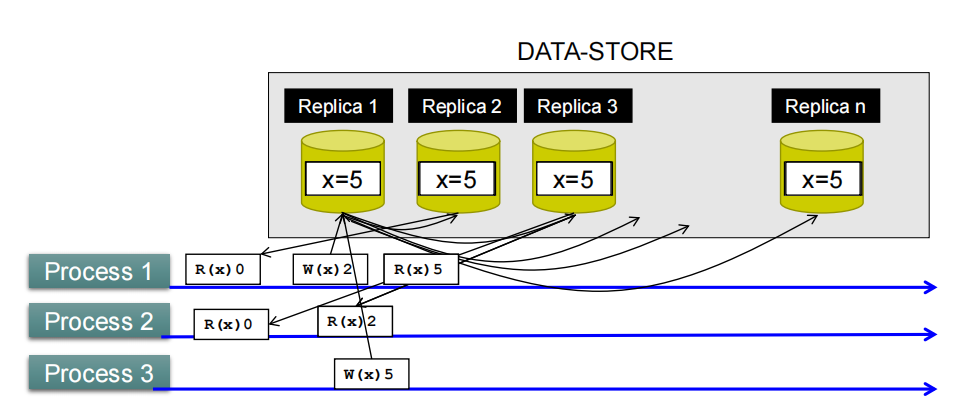
有n个副本，三个进程(读不同的副本，负载均衡，不要造成太大的单点压力)
- p1读副本2读到0，p2读副本3读到0
- p1写副本1写2，这时候就出现不一致了
  - 此时就要副本1发送n-1个消息到其他副本更新值
  - p2就读到了新的值

**写操作之后立刻更新其他副本，严格一致性**
如果写操作频繁，leads to large overheads

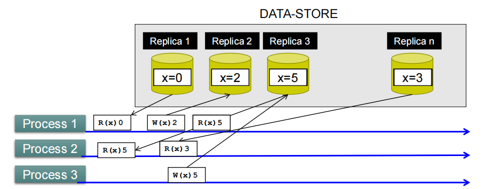
每次读前后值都不一样了，可能读出来的值是很久之前写入的值
**写操作之后并不立即更新，在一个粗粒度的时间进行同步，loose consistency**
存在不一致，但减少了overheads

设计的模型就在上述两个极端找平衡点，取决于应用场景
### Data-Centric Consistency Models
强调数据怎么保持一致性

适合更新操作比较多的场景

#### Consistency Specification Models
量化一致性水平
**Level of consistency** is defined over 3 independent axes
- Numerical Deviation: Deviation in the **numerial values**
  - 定义为n(w)
  - n为其他副本上尚未被副本R看到的操作数量，其他副本还没发给我
  - w偏差的权重，即为所有Conit中变量的更新量的最大值
- Order Deviation: Deviation with respect to the **ordering of update operations**(给定副本R上有多少本地更新没有传播到其他副本)
- Staleness Deviation: Deviation in the staleness between replicas(多久没更新了)

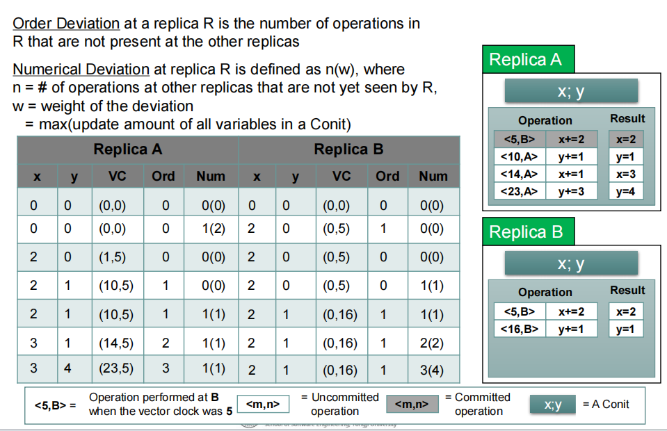
VC为向量时钟
这里一组x、y是一个Conit

- 第一行初始状态
- 第二行副本B开始操作`y+=1`，因此副本B的Ord = 1(有一次操作没有被别人看到)，副本A的Num变为1(2)(还没看到别的所有副本的更新操作次数，括号里面则是一个Conit里面的更新偏移量之和的最大值，只有y增加了2，因此是2)
- 第三行副本A更新x、y值，因此副本A的Num恢复为0(0)，副本B的Ord恢复为0
- 之后便是副本A的不断增加，造成副本B的Num最终为3(4)(3表示3次更新，4表示x，y的偏移量之和最大为4)

#### Models for Consistent Ordering of Operations
三种types of ordering
- total ordering
- sequential ordering
- causal ordering

#### total ordering
**所有进程都对消息或操作的顺序达成一致**就好
要实现总排序，需要满足以下条件：
- 如果进程Pi在一个消息（mi）之前发送了另一个消息（mj），那么所有正确的进程都会在将mi交付给应用程序之前将mj交付给应用程序。
- 如果进程Pi在一个操作之前发送了另一个操作，那么所有正确的进程都会在执行第一个操作之前执行第二个操作。

在总排序中，消息可以包含副本更新，例如传递需要在每个副本上执行的读取或写入操作。

以示例Ex1为例，如果进程P1发出操作m(1,1)：x=x+1; 并且进程P3发出m(3,1)：print(x)；那么在所有副本P1、P2、P3上将按照以下操作顺序执行：
1. print(x);
2. x=x+1;

这意味着在所有正确的副本上，先执行print(x)，然后执行x=x+1。

总排序的实现通常依赖于一致性协议和广播算法，以确保所有进程达成一致的消息顺序。
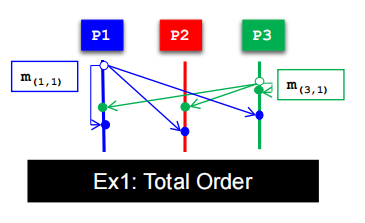

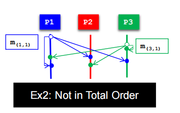

#### sequential ordering
- 在任何进程中，**接收到的消息集合按某种顺序**进行排序。
- **来自每个单独进程的消息按发送者发送的顺序出现在该序列中**。
- 在每个进程上，消息mi,1应该在mi,2之前被传递，而mi,2在mi,3之前被传递，依此类推。
- 在每个进程上，消息mj,1应该在mj,2之前被传递，而mj,2在mj,3之前被传递，依此类推。

**事件的执行顺序和发送顺序要一致**

确保了**消息在接收方按照发送方的发送顺序进行传递**。这种排序机制是为了保证系统中消息的可靠有序传递，以避免可能导致不一致或错误行为的乱序传递。

可以通过一致性协议和时钟同步等机制来实现。一些常见的时序排序算法包括Lamport时钟和向量时钟。
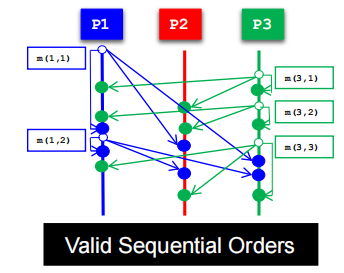

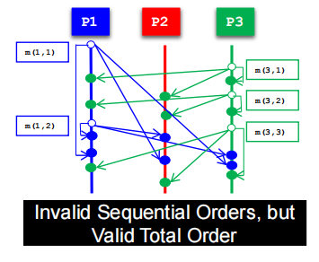
不符合sequential但符合total，每个进程看到的顺序确实是一样的

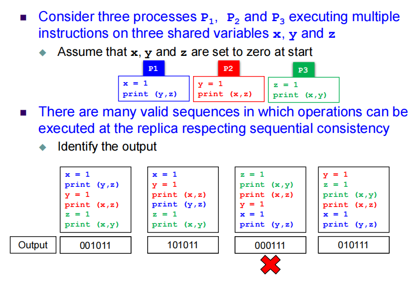
只有第三个不符合sequential ordering，但是另外三个仍然会存在不一致
但有些有些不一样的结果在有些场景是可以接受的

#### causal ordering
因果关联
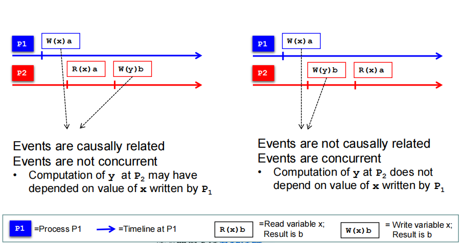
看两个事件有没有因果关联，例如上面计算y的时候依不依赖x

如果进程 Pi 发送了消息 mi，进程 Pj 发送了消息 mj，并且 mi 发生在 mj 之前（用 Lamport 的 happened-before 关系表示为 mi $\rightarrow$ mj），那么任何一个正确的进程在传递 mj 时，会先传递 mi，再传递 mj。

例如，在示例中，消息 m(1,1) 和 m(3,1) 符合因果排序。

然而，因果排序的一个缺点是**在通信之前，mi 和 mj 之间的 happened-before 关系必须先形成。**

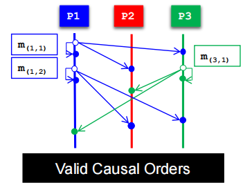

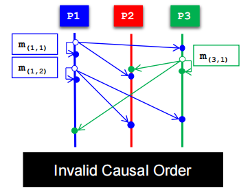

### Client-Centric Consistency Models
以客户为导向，假设客户端在不同时间连接到不通的副本
一致性取决于客户端，客户端要求高就提供新的，要求不高就 :/

客户端中心一致性模型要求满足两个要求：

1. 客户端一致性保证(Client Consistency Guarantiees)：在访问不同副本上的数据值时，应为客户端事件提供一定程度的一致性保证。
2. 最终一致性(Eventual Consistency)：所有副本最终应该收敛到最终的值。

更新操作比较少，读操作比较多，多数时候数据本来就一致，就不用数据为中心的一致性模型

有比较出名的**最终一致性模型**
在较多的应用场景可以容忍不一致性，更新频次较少，但效率高
手机里面更新了购物车，但没有立刻同步到电脑上的购物车里面的内容
#### 最终一致性
Eventual Consistency
许多应用程序可以在很长时间内容忍不一致性的情况。这些应用程序包括：

1. 网页更新：网页的更新可以在一段时间内是不一致的，因为更新的同步可能需要一些时间。
2. 网页搜索：网络搜索涉及爬取、索引和排序等过程，这些过程可能会导致搜索结果的不一致，但是在一段时间后会逐渐收敛到一致状态。
3. DNS服务器更新：对DNS服务器的更新也可能导致数据的不一致，但在没有更新的情况下，所有副本最终会变得一致。

在这些应用程序中，如果数据存储副本之间很少交换更新，那么这种不一致性是可接受且高效的。

一个数据存储被称为最终一致性（Eventually Consistent）如果满足以下条件：

1. 在没有更新的情况下，所有副本会逐渐变得一致。
2. 通常，最终一致性的数据存储很少传播更新。

最终一致性的数据存储中的一些情况：

1. 在最终一致性的数据存储中，写-写冲突是很少见的。这意味着两个同时写入相同值的进程是罕见的。通常情况下，只有一个客户端会更新数据值。例如，只有一个DNS服务器会更新名称到IP的映射。这种罕见的冲突可以通过简单的机制（例如互斥）来处理。

2. 读-写冲突更频繁发生。这种冲突发生在一个进程正在读取一个值的同时，另一个进程正在向同一个变量写入一个值。在最终一致性的设计中，需要着重解决这种冲突以提高效率。

还有很多...

#### Client Consistency Guarantees
provides guarantees for a single client for its accesses to a data-store

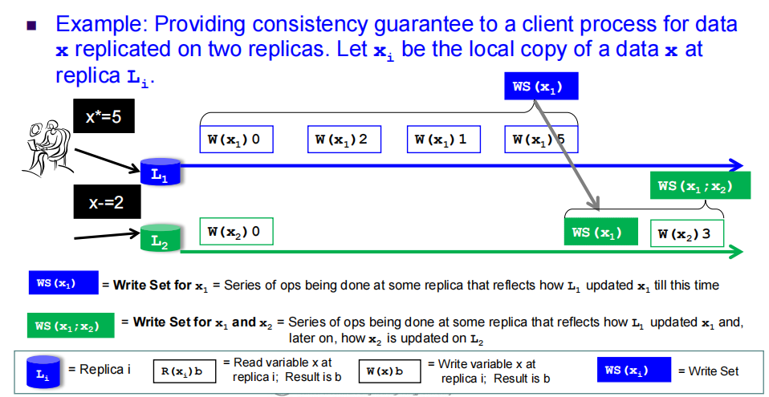

到最后了有一个write set来最后告诉别人更新数据

4 types of client-centric consistency model

##### monotonic reads
provides guarantees on **successive reads**
如果一个客户端进程**读取了数据项x的值**，那么该进程的**任何后续读取操作都应该返回相同或更新的值**。也就是说，后续的读取操作不会返回比之前读取到的值更旧的值。

##### monotonic writes
一个客户端进程对数据项**x的写操作**在**同一个进程对x进行的任何后续写操作之前完成**。 也就是说，一个进程在进行了一次写操作后，必须在**进行下一次写操作之前等待第一次写操作完成**。这样可以确保**写操作按照顺序进行**，并且后续的写操作不会超过先前的写操作。

例子：在复制的大型软件源代码中更新单个库
- 更新可以**懒惰地**传播
- 更新是在数据项的**一部分上执行**的
  - 单个库中的某些函数经常被修改和更新
- 单调写入：如果对一个库执行了更新，则首先更新该库上的所有先前的更新

问题：如果更新覆盖了完整的软件源代码，是否需要更新所有先前的更新？

回答：如果更新覆盖了完整的软件源代码，那么不需要更新所有先前的更新。因为更新是在数据项的一部分上执行的，只需要确保先前对同一个库的更新被更新即可。其他库的更新不会受到影响，不需要重新执行先前对其他库的更新。

##### read your writes
一个进程对数据项x的**写操作的效果将始终被同一个进程对x的后续读操作所看到**。
例子场景：
在密码存储在复制的数据库中的系统中，密码的更改应该立即可见。

回答：在一个系统中，如果密码存储在一个复制的数据库中，当进行密码更改操作时，应该立即能够看到密码的修改结果。
##### write follow reads
一个进程在对数据项x进行先前的读操作后，**对x进行的写操作将在被读取的x的同一值或更近期的值上进行**。
例子场景：
新闻组的用户应该在阅读了所有先前的评论之后才能发布自己的评论。

回答：在一个新闻组中，用户在发表评论之前应该先阅读所有之前的评论，这样他们才能确保自己的评论是基于最新的评论内容

## Replica Management
### When, where and by whom replicas should be placed
### Which consistency model to use for keeping replicas consistent

## Consistency Protocols
Various implementations of consistency models