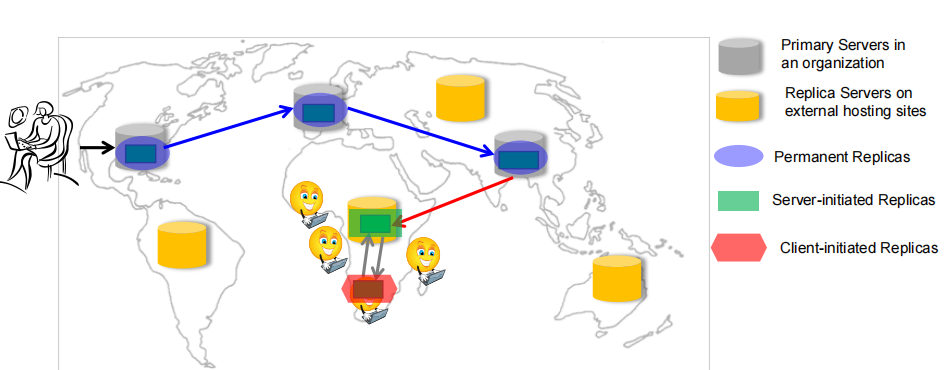
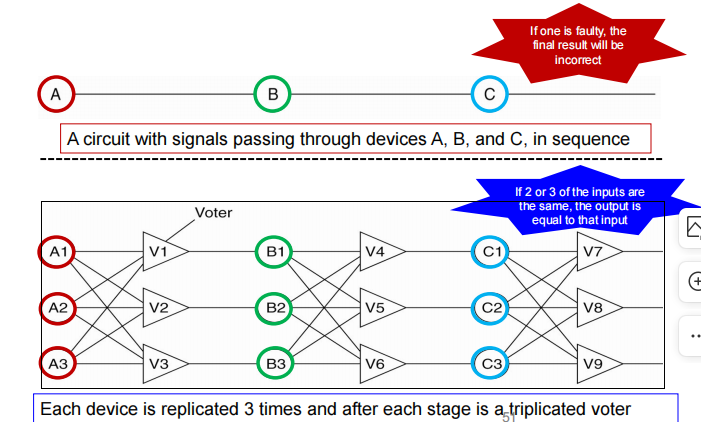

# 副本管理

where, when and by whom

## Replica Server Placement
Factors that affect placement of replica servers
- 服务器放在哪
- 放多少个服务器
- 一个服务器分配多少个去访问上面的类

### 解决方法
如何在可能的多个副本站点中放置k个副本服务器，以便客户端能够获得低延迟和高带宽的连接
邱锂力博士提出一种贪心算法，简单效率高
该算法的步骤如下：
1. **评估**将副本放置在每个可能站点上的**成本**。成本是通过计算**连接到副本的C个客户端的开销来衡量**，可以使用带宽或延迟的倒数作为连接的成本。
2. 选择**成本最低的站点作为第一个副本位置**。
3. 在第二次迭代中，寻找第二个副本位置，使得与已选择的位置相结合时成本最低。
4. 重复步骤2、3和4，直到选择了K个副本位置。

## Content Replication and Placement
还有重要的一点是：how, when and by whom **different data items (contents)* are placed on possible replica servers

这里请求过一次了之后，就有可能放在**更靠近**请求的replica servers，那么之后的请求就更加快了

比如爱奇艺不可能把所有视频都放在每个服务器上，因此我们要有选择

### 永久副本
永久副本是构成分布式**数据存储的初始副本集**。通常**数量较少**。有两种类型的永久副本：
- 主服务器：一个组织中的一个或多个服务器，当请求到达时，将其转发到其中一个主服务器。
- 镜像站点：在地理上分布，并且副本通常是静态配置的。客户端选择其中一个镜像站点来下载数据。

### 服务器发起的副本
服务器主动push的replica

**第三方**（提供商）拥有次要副本服务器，并提供托管服务。
- 提供商在互联网上拥有一组服务器。
- 托管服务在不同服务器上**动态复制文件**，根据文件在某个地区的**流行度**。
- 永久服务器选择将数据项托管在不同的次要副本服务器上。
- 当更新很少时，该方案效率较高。
- 服务器发起的副本的例子是内容传送网络（CDN）中的副本。

### 客户端发起的副本
客户端发起的副本也称为**客户端缓存**。客户端缓存仅用于减少数据的**访问延迟**，例如浏览器将网页缓存在本地。通常情况下，缓存的**管理完全由客户端负责**，但数据存储有时会通知客户端副本已过期。

### summary

副本管理涉及服务器和内容的放置，以提高性能和容错性。

到目前为止，我们已经了解到：
- 如何放置副本服务器和内容
- 应用程序所需的一致性模型

那么，在分布式系统中还需要提供什么来保证一致性呢？

为了在分布式系统中提供一致性，我们还需要考虑以下几个方面：
1. 同步机制：确保不同副本之间的数据一致性，可以使用同步机制，如锁定或事务管理来协调对副本的访问和更新操作。
2. 冲突解决：当不同的副本同时修改相同的数据时可能会发生冲突。冲突解决机制可以帮助确定如何处理这些冲突，例如通过时间戳或向量时钟来确定数据的最新版本。
3. 故障恢复：当副本发生故障或丢失时，需要有机制来进行副本的恢复。故障检测和自动副本恢复是保证系统可用性和一致性的重要组成部分。
4. 一致性协议：一致性协议定义了副本之间如何协同工作以达到一致性的目标。常见的一致性协议包括Paxos、Raft和拜占庭容错协议等。

## Consistency Protocols
model 都是 high level 的原理、算法
protocol 才是实现的

### Primary-based protocols
在**基于主节点**的协议中，采用了一种简单的**集中式设计**来实现一致性模型。

**每个数据项x**都有一个关联的“主副本”，**责协调写操作**。

#### 远程写入协议
**远程写入协议**（Remote-Write Protocol）是其中的一种。

远程写入协议的基本思想如下：
1. 每个数据项都有一个主副本，负责处理所有的写操作。
2. 当客户端想要写入一个数据项时，它必须先与主副本通信。
3. **主副本接收到写请求后，会将新值复制到其他副本**。
4. 在将新值复制到其他副本之前，**主副本会等待所有先前的写操作完成**(此时客户端阻塞的)。

通过使用主副本协调写操作，远程写入协议可以实现**顺序一致性**模型，确保所有副本都按照相同的顺序接收到写操作，并且客户端在读取操作时可以观察到最新的写入结果。

Discussion
远程写入协议提供了以下功能：
- 实现顺序一致性的简单方法。
- 保证客户端能够看到最近的写操作。

然而，远程写入协议的延迟较高：
- 客户端在所有副本更新完毕之前需要等待。
- 在哪些情况下会使用远程写入协议？
  - 取决于最慢的那个副本，副本比较少有希望较低延迟

远程写入协议适用于需要容错性的分布式数据库和文件系统：
- 将副本放置在同一个局域网（LAN）上以降低延迟。

### Replicated-write protocols
在一个复制写入协议中，更新操作可以在多个副本上进行。

#### Active Replication Protocol
主动复制协议：
当客户端在一个副本上进行写操作时，该副本会**将写操作的更新发送给所有其他副本**。
主动复制面临的挑战：副本之间无法保证操作的顺序。

集中式主动复制协议：
方法：
存在一个称为序列化器（Seq）的集中式协调器。
当客户端连接到一个副本RC并发出写操作时：
- RC将更新转发给Seq。
- Seq为**更新操作分配一个序列号**。
- RC将序列号和操作传播到其他副本。
所有副本按照序列号的顺序执行操作。

### Cache-coherence protocols
一般对于客户端说的是cache，服务端说的是replica，但有的地方不做严格区分

缓存一致性协议确定了如何保持缓存一致性。
当数据项被修改时，缓存可能会变得不一致：
1. 在服务器副本上修改
2. 在缓存中修改

当数据在服务器上被修改时
强制一致性的两种方法：
1. 服务器发起的失效：服务器在**数据项被修改时向所有缓存发送失效消息**。
2. 服务器更新缓存
服务器将更新传播到缓存。

当数据在缓存中被修改时
强制一致性的协议可以使用以下三种技术之一：
1. 只读缓存
缓存不修改缓存中的数据，更新传播到服务器副本。
2. 写通缓存
直接修改缓存，并将更新转发给服务器。
3. 写回缓存
客户端允许在缓存中进行多次写操作，客户端将一批写操作批量发送给服务器副本。

# Fault-tolerance容错

## Basic Concepts

### 可信任性（Dependability）
基本概念：一个组件提供服务给客户端。为了提供服务，组件可能需要从其他组件获取服务，因此一个组件可能依赖于其他组件。
具体而言：如果组件C的行为正确性依赖于组件C∗的行为正确性，则组件C依赖于C∗。

可信任性的一些属性：
- 可用性：准备好供使用
- 可靠性：连续的服务交付
- 安全性：非常低的灾难发生概率
- 可维护性：系统故障后的修复容易程度

注意：对于分布式系统，组件可以是进程或通道。

### 术语（Terminology）
术语解释

失效（Failure）：当一个组件没有达到其规格要求时，就会发生失效。

错误（Error）：指组件状态中可能导致失效的**部分**。

故障（Fault）：是错误的**原因**。不可避免的。

故障预防（Fault prevention）：防止故障的发生。

容错性（Fault tolerance）：以一种能够在存在故障的情况下满足其规格要求的方式构建组件（即掩盖故障的存在）。

故障排除（Fault removal）：减少故障的存在、数量和严重程度。

故障预测（Fault forecasting）：估计当前故障数量、未来发生率以及故障的后果。

### 原因
- 硬件故障：硬件组件出现故障导致失效。
- 软件错误：软件中存在错误或缺陷导致失效。
- 操作员错误：操作员的错误操作导致失效。
- 网络错误/断网：网络故障或断网导致失效。

系统被认为失败，当它无法满足其承诺的时候。

### 在分布式系统中
分布式系统与单机系统的一个特点是**部分失效**(partial failure)的概念。
当分布式系统中的一个组件发生故障时，这种部分失效可能会影响其他组件的正常运行，同时对另外的其他组件没有影响。

### 目标和容错性
在分布式系统中的一个总体目标是构建系统，使其**能够自动从部分失效中恢复过来**。

容错性是使系统在**出现故障faults**的情况下能够继续正常运行的属性。

例如，TCP被设计成在分组交换网络中实现可靠的双向通信，即使存在不完美或过载的通信链路。丢包肯定存在的，但TCP通过协议实现可靠的服务。

### Faults, Errors and Failures

容错是即便发生了faults但是还能提供服务

### 容错性的要求
1. 不存在单一故障点：表示系统中没有单一的组件或部件**可以导致整个系统失效**。
2. 故障隔离/限制：表示当一个组件发生故障时，系统能够将**故障局限在该组件**，并防止故障扩散到其他部分。
3. 提供回退模式：表示系统需要**具备能够切换到备用模式或备份组件的能力**，以确保持续的可用性。

### Dependable System

## Failure Models

| 故障类型 | 描述 |
| --- | --- |
| 崩溃故障Crash Failure | 服务器停止运行，但在停止之前正常工作 |
| 遗漏故障Omission Failure(Receive Omission/Send Omission) | 服务器不能回应incoming的请求(fails to receive/rend) | 
| 时序故障 | 服务器的响应超出指定的时间间隔 |
| 响应故障(Value Failure/State Transition Failure) | 服务器的响应不正确(响应的值错误/服务器偏离正确的控制流程) |
| 拜占庭故障 | 服务器可能在任意时间产生任意的响应 |

## Fauilure Masking by Redundancy
人不够钱来凑，通过冗余机制

### 冗余

冗余是遮蔽故障的关键技术之一。冗余可以通过以下方式实现：

- 信息冗余：通常会添加额外的位来纠正错误位，以便从被破坏的位中恢复。
- 硬件冗余：通常会添加额外的设备来容忍出现故障的硬件组件。
- 时间冗余：通常会执行某个操作，然后如果需要，再次执行该操作，以获得更可靠的结果。
- 软件冗余：通常会添加额外的进程来容忍出现故障的进程。

### Triple Modular Redundancy

三重模块冗余（Triple Modular Redundancy，TMR）是一种常见的冗余技术。在TMR中，信号通过设备A、B和C按顺序传递。每个设备都被复制三次，并在每个阶段之后都有一个三重复投票器，用于选择正确的输出。

### Process Resilience and Failure Detection

#### Process Resilience
Tolerating a faulty process的关键方法是将**多个相同的流程组织成一个组**。
如果组中的一个process出现故障，希望其他一些process能够接管。

注意事项：
- 一个process可以在系统运行过程中加入或离开一个组。
- 一个process可以同时是多个组的成员。

组又有中心化和去中心化的分别
- Flat Group不容易达成一致
  - Symmetrical
  - No single point of failure
  - Decision making is complicated
- Hierarchical Group管理的那个节点出问题就寄了，但是容易管理
  - Decision making is simple
  - Asymmetrical
  - Single point of failure

#### K-Fault-Tolerant System

如果一个系统可以在k个组件出现故障的情况下仍然满足其规格要求，那么我们可以称这个系统为K-Fault-Tolerant System。

我们如何实现一个k-容错系统呢？

这需要对一个流程组应用一种协议来达成一致。通过组织多个相同的流程成为一个组，并使用一种协议来确保在组内出现故障时仍然能够满足系统规格要求，从而实现k-容错系统的目标。

#### Agreement in Faulty Systems
在一个流程组中，通常需要达成以下方面的协议一致：
- 选举coordinator
- 决定是否提交事务commit a transaction
- 将任务分配给工作人员workers
- 同步操作

当通信和流程都是
- 完美的时候，达成一致往往是直接的。
- 不完美时，达成一致会出现问题。

目标：让**所有非故障进程就某个问题达成共识，并在有限的步骤内确定该共识**。

对于底层系统的不同假设需要不同的解决方案：
- 同步与异步系统
- 通信延迟是否有界
- 消息传递是否有序
- 消息传输是通过单播还是多播

在以下情况下才可能达成一致

在实践中，大多数分布式系统假设：
- 进程是异步的
- 消息传输是单播的
- 通信延迟没有界限
- 通常需要使用有序（可靠）的消息传递
- 协议达成一致问题最初由Lamport研究，被称为拜占庭协议问题[Lamport et al.]。

##### 拜占庭将军问题
- 问题背景：解决在分布式系统中存在故障节点的情况下，如何使各个节点就一个共同的决策达成一致。
- Lamport 假设：
  - 进程是同步的。
  - 消息是有序的单播。
  - 通信延迟有界。
  - 有 N 个进程，每个进程提供一个值给其他进程。
  - 最多有 k 个故障进程。

消息传递和向量构建
- Lamport 提出每个进程构建一个长度为 N 的向量 V，如果进程 i 是正常的，V[i] = vi，否则 V[i] 未定义。
- 过程包括进程发送值、收集值到向量、向其他进程传递向量。

拜占庭一致性算法步骤
1. **每个进程发送值给其他进程。**
2. **每个进程收集接收到的值构成向量。**
3. **每个进程将自己的向量传递给其他进程。**
4. **每个进程检查新收到向量的第 i 个元素，如果有多数值，将该值放入结果向量；否则标记为 UNKNOWN。**

案例分析
1. **N=4，k=1的情况：**
   - 过程包括发送值、收集向量、传递向量、达成协议。
   - 算法成功达成一致。

2. **N=3，k=1的情况：**
   - 过程相同，但结果向量中可能包含未知值。
   - 由于节点故障，算法未能达成一致。

结论和相关工作
- Lamport 等人证明在有 k 个故障进程的系统中，只有当存在 2k+1 个正常运行的进程时，才能达成协议。
- Fisher 等人证明在无法保证消息在已知有限时间内按顺序传递的分布式系统中，即使只有一个进程故障，也无法达成协议。

#### 故障检测（Failure Detection）
- 在正式屏蔽故障之前，必须先进行故障检测。
- 对于一组进程，非故障成员应能决定谁仍然是成员。
- 两种策略：
  - 进程主动发送“你还活着吗？”消息（即相互ping）。
  - 进程被动等待来自其他进程的消息。

#### 超时机制（Timeout Mechanism）
- 故障检测通常涉及超时机制。
- 指定一个计时器，在一段时间后触发超时。
- 由于网络不可靠，简单地因为未返回ping消息就宣布进程故障可能是错误的。

##### 案例：FUSE
- FUSE中，进程可以加入跨越广域网的组。
- 组成员创建用于监视成员故障的跨度树。
- 使用主动（ping）策略，单个节点故障迅速升级为组故障通知。

##### 故障检测子系统设计考虑
1. 故障检测可作为定期与邻居交换信息的副作用（例如，基于八卦的信息传播）。
2. 故障检测子系统理想情况下应能区分网络故障和节点故障。
3. 检测到成员故障时，应如何通知其他非故障进程。

#### 恢复（Recovery）
- 强调在容忍故障的算法之后，故障发生时进程如何恢复到正确状态。
- 着重点：
  - 恢复到正确状态的实际含义。
  - 记录和恢复分布式系统状态的时机和方式，通过检查点和消息日志。

日志虽然写得快，但是恢复比较慢，所以一般会与checkpoint结合

##### 错误恢复（Error Recovery）
- 在错误发生后，关键是使发生错误的进程能够恢复到正确状态。
- 两种错误恢复形式：
  1. **向后恢复（Backward Recovery）：**
     - 将系统从当前错误状态返回到先前正确状态。
     - 需要定期将系统状态记录到稳定存储，并在出现问题时还原记录的状态。
  2. **向前恢复（Forward Recovery）：**
     - 在系统检测到发生错误时，将系统状态回滚到错误时间并纠正它，以便能够继续前进。

##### 检查点（Checkpointing）
- 在容错分布式系统中，向后恢复要求系统定期将其状态保存到稳定存储。
- 检查点是存储当前应用程序状态的分布式快照，以便在发生故障时重新启动执行。

##### 消息日志（Message Logging）
- 为了减少检查点数量但仍实现恢复，引入了消息日志技术。
- 通过记录和重放传输的消息，可以达到全局一致状态，而无需从稳定存储还原状态。
