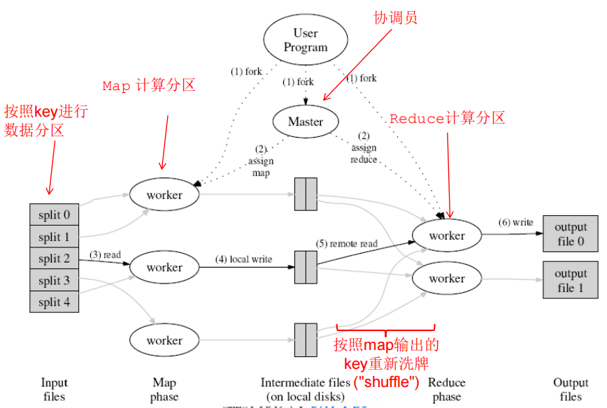

# MapReduce

## 概述
全国人口普查，不是简单地统计，还有其他聚合问题
- 如何分配人员去调查，有的地方人多，有的地方很大
- 每个人员调查习惯不同，能力不同，生病了怎么办
- 表格填写错了
- 管控普查进度

我们希望
- 有弹性，可以容错
- ...

好了有个系统帮我们处理这些细节，MapReduce框架

抽象成数据流：过滤预处理、聚合、再计数
两类 workers
- 处理输入数据，输出生成结果 stacks
- 处理结果 stacks ，然后 aggregate 生成最终结果

MapReduce 两个重要部分
- map：处理(item_key, value)，生成一个或多个(stack_key, value)
- reduce：处理(stack_key, {set of value})，生成一个或多个输出结果(stack_key, agg_value)

## 体系结构
Mapper 及 Reducer 应该是无状态的
- 返回值避免使用 static 便令
- 应为不清楚kv会在哪个workder上处理

不要自己写I/O
- 不要写从文件系统进行读写文件的代码
- MapReduce 框架会自动进行读写文件的操作
  - 所有输入数据会自动作为 map 和 reduce 这两个函数的参数
  - 任何自定义函数的输出结果均应该通过 emit 完成

Mapper 避免一个 key 对应过多数据
- 不要把所有数据对应到一个 key
- 否则某一个 reducer 工作负载过高，其他空闲
- 可接收情况：某些 reducers 的工作负载比其他的高

很长的倒排表排序

为什么写比读多，因为每次写都要写每个副本，读只用读一个

map、reduce输入输出都是到HDFS里面写入文件，但是迭代次数过高一条链就不行

SQL能做的，都可以通过MR来做

但是为什么不用 SQL 数据库来做呢，因为对于海量数据 SQL 分布式数据库成本比较高，里面通过 ETL（抽取（Extract）、清洗转换（Transform）之后加载（Load）） 代价也比较大

增加 combiner 操作，在**同一台机器上**的多个 map 进程可能有多个相同的key，我们先进性 combiner 然后再发送给 reduce 减少发送次数

做 join 的时候，有时候两个 table 的大小不同
- 小的就在 map 里面内存直接做了
- 大的话，可以考虑设计概要数据结构，做预处理，通过一些数据结构 bitMap...，类似索引但是比哈希表内存小

在两个集合中两两计算节点的距离，1000个节点和100个节点，将一个集合分块，设置 landmark

# Hadoop
将 HDFS 和 MR 结合起来，就是存储查询功能的数据库了，这里以 Hadoop 为例

History
- lucene: search indexer
- nutch: a spider/crawler
  - 避免重复访问带宽消耗

需要有调度策略，既能保证能找到新东西而减少带宽浪费

但是有些网页更新频度高，需要更高频次的重复访问；有些更新频度低

爬虫爬爬爬爬到的网页越来越多，需要更多的节点去存储，我们就需要有效管理的策略

迪杰斯特拉如何进行并行化优化