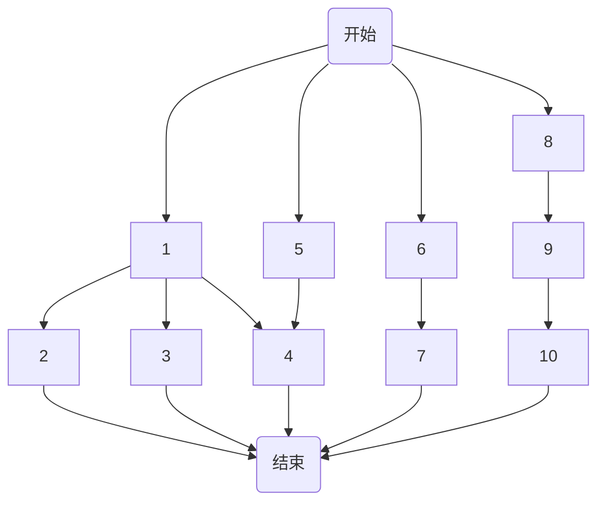

# 分布式计算
**Scale increases complexity**
- 单核服务器
- 多核服务器
- 集群
- 复杂的分布式系统数据中心(网络)

困难
- 并发性True concurrency
- 网络，消息传递，失效模型(故障节点...)Network Message passing，More fallure models
- 广域网，更多更复杂的失效模型，各种系统设计方法和定律Wide-area network, Even more failure models, incentives, laws

**Symmetric Multiprocessing(SMP)**
多核CPUs可以访问共享内存

假设: 每个核均可以访问任意一个字节数据, 相同的访问速度 (即每个字节，无论是读写操作，均花费同样的时间)
注意：当然不是所有的机器是符合这样的假定，其他的模型将此后讨论

## 并行编程模型以及存在的问题
### 并行化、可扩展性、Amdahl定律
#### 可扩展性
系统可以灵活适应需求的增加和减少

例如：存储系统可以在开始阶段有10TB，还能够通过增加**更多节点**使得**存储能力提高**到PB级别

还意味着
- the ability to operate at a very large scale
- the ability to grow efficiently

还要考虑成本

#### 并行化
冒泡排序和归并排序
归并排序中的**某一部分**就可以进行并行化处理，但最后还是要串行几个大部分

随着核数增加，加速比$S_N = \frac{T_1}{T_n}$只会增加到一个特定的点

利用Amdahl定律，整体的加速比$S_{overall} = \frac{1}{(1-f) + \frac{f}{S_{part}}}$

也不是并行度越高越好，随着核数增加，排序的速度会有一个峰值(Sweet spot)
调度会产生开销，占用总线带宽

**并行粒度**
给定一个任务，每个核需要分配多大的计算内容

两个极端
- 频繁的任务调度会导致额外的计算开销
- 粗粒度的并行化往往效率更高

**依赖关系**
限制了并行度
最小的整体任务完成时间(最大加速比)取决于开始到完成的最长路径

**异构性**
- 有些任务比其他任务计算量更大
- 有些任务比其他任务计算时间更长
- 有些任务优先级更高
- 并非所有计算都是均等速度

**并行很难**
- Amdahl定律
- 人物之间的依赖关系
- 通信的开销
- 异构性
### 同步、一致性
引入：银行同时存钱取钱问题

#### 问题
竞争
- 计算结果取决于线程的执行时间，即指令的执行顺序
- 缘由：对一个状态的**并发更新**

#### 目标
一致性
不管请求是否并发执行，结算结果均不应有差别

需要通过**一致性模型**描述系统在并发情况下的行为方式

**问题**
如何确定Access/Update Ratio

#### Reasons for Replication
副本有好处的

1. 性能方面：
   - 可伸缩性：通过复制数据，可以增加系统的容量和规模，以处理更大量的数据或更多的用户请求。这意味着系统可以适应增长，并保持良好的性能。
2. 可靠性方面：
   - 掩盖故障：复制数据可以使系统更具弹性，即使某个组件或节点失败，仍然能够继续提供服务。当某个服务器或位置不可用时，其他复制的服务器或位置可以接管工作，确保服务的连续性。
   - 掩盖损坏数据：如果数据在一个位置或服务器上损坏或变得不可靠，通过复制数据，可以在其他位置或服务器上保留一份副本。这样可以确保即使原始数据出现问题，仍然可以使用复制的数据进行操作或提供服务。

3. 例子
   - Web缓存：Web缓存是指将经常访问的Web页面或资源**复制到位于更接近用户的缓存服务器**上，以提高访问速度和减轻原始服务器的负载。通过在多个地理位置设置缓存服务器，可以实现更好的性能和可扩展性。当用户请求特定网页时，缓存服务器可以直接提供响应，而无需从原始服务器检索页面，从而降低了延迟并提高了用户的体验。
   - 横向服务器分发：在高流量或大规模的应用程序中，将服务器**水平分布在不同的地理位置或数据中心**是一种常见的策略。通过复制和分发服务器，可以更好地处理用户请求，并提供更高的可靠性和冗余性。当一个服务器发生故障或变得不可用时，其他复制的服务器可以接管它的工作，确保服务的连续性。这种方式还使得应用程序可以根据用户所在的地理位置选择最近的服务器，提供更快的响应时间。

**代价**
- 副本会带来**一致性问题**
- 本来副本是为了更好的性能
- 修改一个副本triggers 对其他所有副本的修改
- 将修改传送到每个副本会降低性能

平衡性能和一致性的需求。在一致性方面做更多的传播和同步会保持数据的一致性，但可能会牺牲一部分性能。相反，为了提高性能，可以选择减少传播和同步的频率，但这可能会导致副本之间的数据不一致

#### 一致性模型
Consistency Model = **When and how** the modifications are made

弱一致性模型 & 强一致性模型

一个进程对数据项执行读取操作，并期望操作返回的值反映了对该数据项的最后一次写操作的结果。然而，由于**没有全局时钟，很难定义最后一次写操作**。不同的一致性模型对读取操作可能返回的值有不同的限制。

在分布式系统中，**由于存在多个副本和并发操作，无法保证立即一致性**。不同的一致性模型定义了不同的规则和限制来处理读写操作的顺序和一致性。这些模型包括**强一致性、弱一致性、最终一致性**等。

强一致性模型要求读操作返回的值必须反映最后一次写操作的结果，无论在哪个副本上进行写操作。这通常涉及使用复杂的协议和算法，以确保在分布式系统中实现数据的严格一致性。

然而，在没有全局时钟的情况下，实现强一致性可能会产生**较高的延迟和性能开销**。因此，一些系统选择使用弱一致性或最终一致性模型，它们允许在副本之间存在一定的数据不一致性，但会尽力保证数据最终一致。

##### 顺序一致性
是一种强一致性模型，最严格的模型
- 任意一种情况的执行结果均相同
- 所有的核均以某个串行的顺序进行计算处理
- 每一个核在其中的执行顺序均与程序指定的顺序一致

需要强大的硬件和软件支持，尤其在多核处理器和分布式系统中更加困难

##### 其他一致性
强一致性模型要求在**更新完成后，所有后续的访问都返回更新后的值**。换句话说，所有操作都按照严格的顺序执行，保证数据的一致性。

弱一致性模型则允许在**更新完成后，后续的访问不必立即返回更新后的值**。但是，它需要满足某些特定条件，例如更新值必须达到数据对象的所有副本。弱一致性模型有一些变体，如因果一致性、单调写等。

最终一致性模型是一种**特殊形式的弱一致性**模型，它保证**如果不再有更多更新，则所有读操作最终会返回最新的值**。最终一致性模型可以有一些变体，如因果一致性、读写一致性、单调写等。

**为什么会有这么多模型**
这些一致性模型存在的原因是因为在分布式系统中，要在一致性和性能之间进行权衡。不同的应用场景可能需要不同级别的一致性保证。

### 互斥、锁、锁机制所产生的问题
### 体系结构SMP/NUMA/Shared-nothing

## 分布式编程以及难点
### 网络分隔故障、CAP定理
### 故障、失效以及对应方法

希望每个CPU都在工作，不造成资源浪费

没有全局时钟，不知道操作谁先谁后，导致了上一步写操作