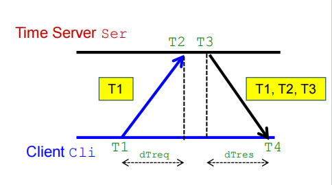
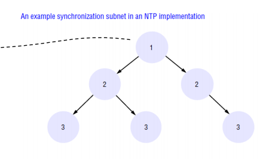
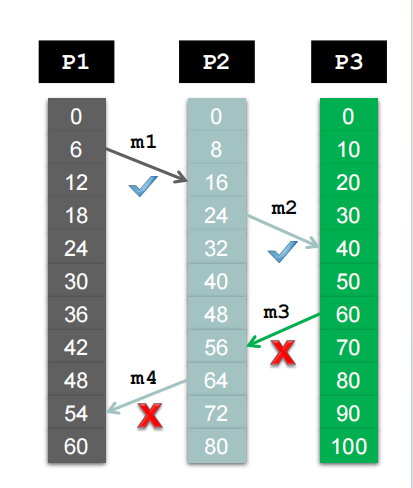
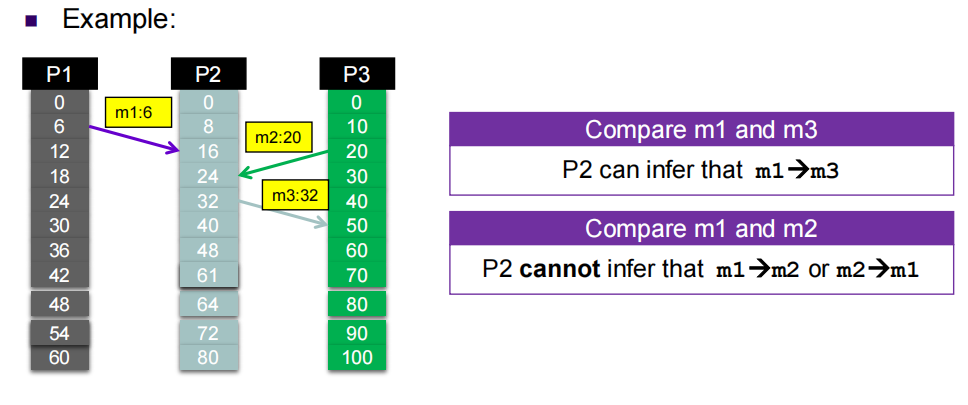
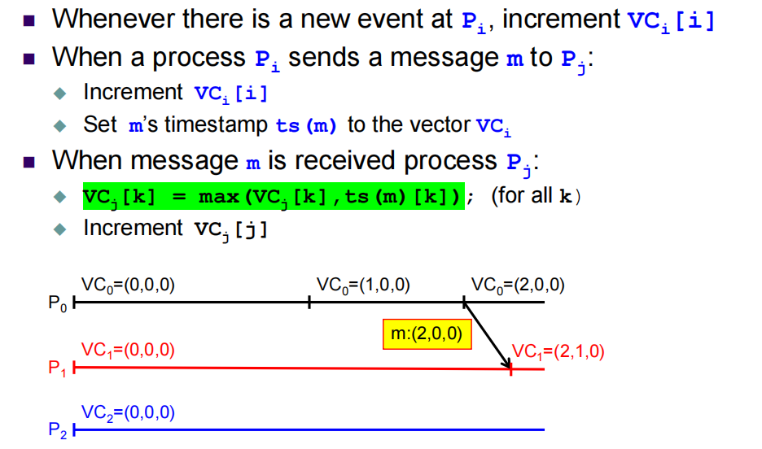
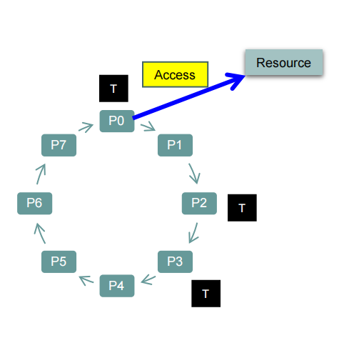
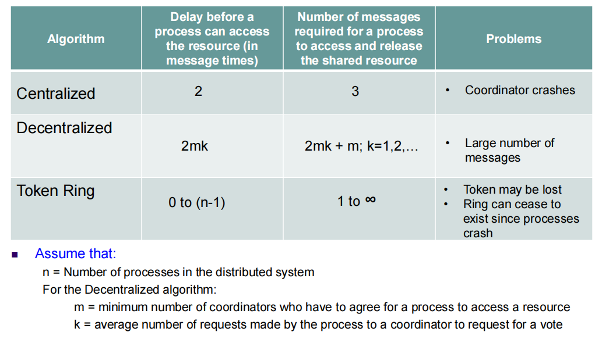
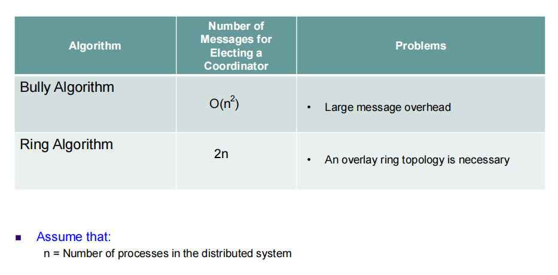

# syn

have to **cooperate** and **synchronize** to solve the problem correctly

|缘由|举例|设计需求|主题|
|:--:|:--:|:--:|:--:|
|实体需要对事件发生的时间顺序达成一致|相机传感网络的车辆追踪, 分布式电子商务系统的商业交易操作|Entitles should have a common understanding of time across different computers|Time Synchronization|
|实体需要对分享公共资源达成一致|分布式文件系统的读写操作|Entitles should coordinate and agree on when and how to access resources|Mutual Exclusion(互斥)|

将每个节点的时钟同步成全局时钟

## 应用场景
### 追踪可疑车辆
- 相机部署到整个城市范围
- 每个相机传感器检测车辆信息, 并向中心服务器报告检测到车辆的时间信息
- 服务器追踪可疑车辆的运动轨迹

难点在于每个相机不一定都能维护统一的时间信息，就追踪出问题了
### 分布式文件系统的写操作
如果分布式的客户端在写文件的过程中不考虑写操作的同步机制, 该文件的数据内容损坏
要按顺序写，不然就一个覆盖另一个了

## Time Synchronization
### Clock Synchronization
#### Coordinated Universial Time(UTC)
- All the computers generally synchronized to the **primary time standard**
- UTC is broadcast via the **satellites** with an accuracy of 0.5 msec
- PC通过有接收器的集群获取的时间进行校准，PC没有接收器因为太贵了
- The most physical clocks use **atomic oscillators**

#### Tracking Time on a Computer
材料的老化等等都会导致电脑时钟偏移

如何衡量

$Skew = \frac{dC}{dt} - 1$

设置一个区间，最大许可漂移率(maxium drift rate)$\rho$
$1 - \rho \le \frac{dC}{dt} \le 1 + \rho$

#### Clock Synchronization Algorithm
##### Cristian's Algorithm
- basic idea
  - identify a **network time server** than has a accurate source for time(g.g. the time server has a UTC receiver)
  - All the client contact the network time server for synchronization
- 但是**网络延迟**，需要估计网络延迟然后补偿

Cli和Ser可能有误差，T1和T2误差不准确也不知道谁早
Cli将T1发送过去
Ser将T1、T2、T3发送回去

已知T1 < T4、T2 < T3

但我们Assuming than the transmission dalay from Cli to Ser and Ser to Cli are the same上行下行延迟相同
$T2 - T1 \approx T4 - T3$
Cli estimates the offset $\theta$ relative to teh Ser
$$
\theta = T3 + dTres - T4 \\
= T3 + ((T2 - T1) + (T4 - T3)) / 2 - T4 \\
= ((T2 - T1) + (T3 - T4)) / 2
$$

Then the Cli Time should be incremented or decremented by $\theta$

Instead of changing the time drastically by $\theta$ seconds, typically the time is **gradually** synchronized
一下子改变时钟太快了对计算机不好

Discussion
- Cristian's algorithm assumes that the round-trip times for message exchanged over the **network** is **reasonably short**，在局域网中，但是广域网要的时间可能不短了
- the delay for the request and response are equal
- 服务器故障或服务器时钟故障，同步就不行了
- 没办法保证客户端最大的时间漂移
##### Berkeley Algorithm
- 不依赖UTC，通过所有计算机的时间调和平均
- 一个服务器故障了，再选一个当服务器就好了
- 也是局域网中比较好，广域网就有延迟不得
- 但可能出现离群点，需要剔除

- Approach
  - A time server periodically sends its time to all the computers and polls them for the time difference
  - The computers compute the time difference and then reply
  - The server computes an **average** time difference for each computer
  - The server commands all the computers to update their time(by gradually time synchronization)
##### Network Time Protocol
广域网中能用
现在设备基本都是这样同步
**NTP** defines an architecture for a time service and a protocol to distribute time infomation over the Internet.

servers are connected in a **logical hierarchy** called **synchronization subnet**

**一般第一级root有最精密的时钟信息UTC receiver，精密度随层级下降**

只有低级的才需要与高级的进行同步，同时更新作为高级的下一层级，高级的不需要与低级同步

同步还类似Cristian' algorithm，但不同的是通过**多次采样**使用统计出来的结果

- 可以保证UTC时间的精密同步
- 可扩展性
- 可靠性
- 安全认证机制

#### Summary
物理时钟不精密，需要同步

### Logical Clock Synchronization
Logical clocks are used to define **an order of events** without measuring the physical time at which the events occurred
不关注timestamp的值，而是直接关注**事件的次序**
不需要硬件，成本更低
#### Lamport's Logical Clock
The expression $a \rightarrow b$ read as "a happened before b"
执行完了再发消息

**happened-before** relation is transitive(可传递性)

assign a logical time value `C(a)` on which all processes agree

哪个先发生哪个就小 if $a \rightarrow b$, then C(a) < C(b)

C must always go forward(increasing)时间不可逆转！

通过Middleware layer的形式实现

##### Example

P3发回给P2的时候出现差错(两者逻辑时钟增长速率不同，出现"time reverse")，需要同步
直接在收到的senderMessage的基础上 + 1(currentTime = timestamp + 1)

##### Limitation
但是不能说C(a) < C(b)就说明$a \rightarrow b$

However, Lamport’s clock **cannot guarantee perfect ordering of events** by just observing the time values of two arbitrary events

#### Vector Clock
更加复杂但是功能强大

记录二维的向量，每个进程都记录自己所知道的别的进程的逻辑时钟值(事件发生的个数)
不同的进程通过传消息来知道别人的
这样就可以逆推**特定**事件的发生顺序了

if $VC_i(a) < VC_i(b)$, then we can infer that $a \rightarrow b$

Supports causal ordering of events!

##### Example

接收的两个步骤
- 绿色的是取当前的VC和发送过来的信息中的最大值
- 然后再增加$VC_j[j]$

## Mutual Exclusion
通过消息传递
Mutual exclusion algorithms are classified into two categories
- Perssion-based Approaches
  - process去访问共享资源的时候要得到许可
  - 通过专门的单独的Coordinator管理
  - Coordinator坏了就寄了
- Token-based Approaches
  - 每个共享资源都有一个令牌，一个process有了这个token才能去访问资源
  - token在processes之间传递、通信
  - 令牌丢了就抓瞎

### Perssion-based
- Centralized Algorithms

  最简单，但容错机制不行，Coordinator一旦故障就寄了

  负载也不行，排队的很多，又要处理排队，又要释放

  Coordinator，通常标记为C，负责管理共享资源的访问。具体解释如下：

  1. 协调者（C）维护一个请求访问资源的队列。

  2. 当一个进程想要访问共享资源时，它会向协调者发送一个请求消息，请求访问资源。

  3. 当协调者收到请求时：
    - 如果没有其他进程当前正在访问该资源，协调者会通过发送一个"grant"消息来授予访问权限给请求的进程。
    - 如果另一个进程正在访问资源，协调者会将请求排入队列，并不会立即回复请求。

  4. 进程在访问资源之后，释放独占访问权限。

  5. 协调者会随后向队列中的下一个进程发送"grant"消息，以便下一个进程可以访问资源。

- Decentralized Algorithms
  使用了分布式哈希表(Distributed Hash Tbale, DHT)，哈希表实现均衡负载
  某个资源的复制n次的replica起名为`rname-i`
  Every replica **has its own coordinator** for controlling access

  通过majority vote算法去选举coordinators，超过一半才可以 m > n / 2
  如果一个coordinator不想对一个进程投票(因为已经vote for another)，就发送"permission-denied"

  从而规避了一个coordinator宕机就寄了
  但是网络带宽消耗更多，性能会慢
### Token-based
每一个资源都有其对应的令牌
沿着一个环传递
等待的时间是处理时间 + 传递token的时间

- 去中心化
- avoid starvation，一个环肯定能传到
- 没有进程需要某个资源的时候，其令牌高速转圈
- 令牌丢失就要重新生成，但是好巧不巧原来的令牌又找到了，又要剔除其中一个，这样开销就出来了
- Dead processes must be purged from the ring，不然就一直阻塞了
- 也可以通过greedy algorithm加速，改变跳数，不一定是neighbor by neighbor

### Comparison

## Election Algorithm
很多分布式算法都需要一个process充当一个coordinator

因为每个节点只知道部分的信息，不知道全局信息，要知道其他的就要通过**消息传递**

### Election Process
- Any process $p_i$ in the DS can **initiate** the election algorithm that elects a new coordinator
- At the termination of the election algorithm, the elected coordinator process should be **unique**
- Every process *may* know the process ID of every other processes, but it **does not know which processes have crashed**
  - 通过心跳等方法，检测是否还alive
- Generally, we require that the coordinator is the process with the **largest process ID**
  - 举个例子而已，也可以是最小的process ID
  - 由此elect the best coordinator

### Bully Algorithm
- $P_i$给所有更大的进程ID的proceses发送"Election"消息 
- $P_j(i \gt i)$收到消息了，回应"Take-over"消息
  - 然后$P_j$也发送更大进程ID的进程"ELection"消息
- if no one respends, $P_i$赢得选举！发送"Coordinator"给所有进程

### Ring Algorithm
Be used in a ring topology

- $P_i$ builds an "Election" message(E), and sends it to its next node. It inserts its ID into the Election message
- When process $P_j$ receives the message, it **append** its ID and forward the message
  - if the next node has crashed, $P_j$ **finds the next alive node**
- When the message gets back to the process that started the election
  - it elects process with the **highest ID as coordinator**
  - changes the message type to "Coordination" message(C) and circulates it in the ring(告诉每个节点选出来的coordinator是谁)

### Comparison

选举算法为了原来的发生故障了，选举一个新的unique进程作为coordinator

选完了所有节点都要知道新选出来的是哪个

