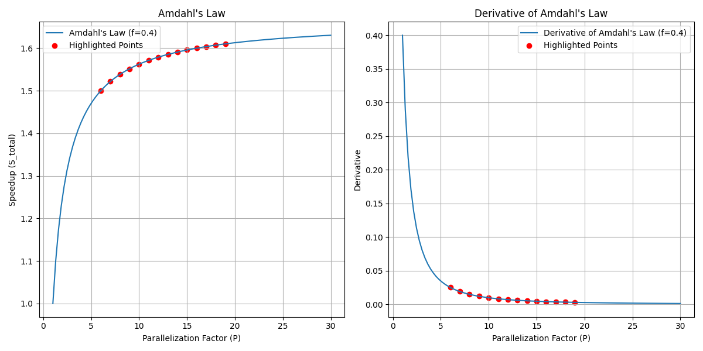

# 1
(a)
(b)
(d)

# 2
有时候我们不需要那么强一致性模型，在分布式系统中这可能会产生较高的延迟和性能开销。

在一些对速度要求比较高、但一致性要求较低的情景下，我们就可以考虑弱一致性模型，它允许副本之间存在一定的数据不一致性，但会尽力保证数据的最终一致。

为什么会出现这些不同的一致性模型，都是由场景驱动导致的，不同的场景需要有最适合它的一致性模型。

# 3
在分布式系统中，需要确保各个节点在分布式环境中有一致的时间概念，不同的节点可能位于不同的地理位置，运行在不同的硬件和操作系统上，它们的时钟可能会存在不同程度的漂移和偏差。如果没有时钟同步，将会给分布式系统的各项功能带来严重问题，通过时钟同步，各个节点可以协调地进行事件顺序的判断、时间戳的比较，并在共享数据和进行分布式计算时保持一致。
设计要求
- 准确性：需要使得整个系统获得一致的时间戳
- 可靠性：应该还需要处理网络延迟、时钟漂移等问题，保证同步的可靠
- 容错性：在某些节点发生故障的同时还能继续保持其他剩余节点的时钟同步
- 灵活性：需要适应不同的网络拓扑结构
- 安全性：需要防范潜在的时钟同步攻击，防止系统中的时间信息被篡改
- 高效性：需要尽可能减少同步对系统性能的影响给

# 4
根据 Amdahl's Law: $S_{overall} = \frac{1}{(1 - f) + \frac{f}{S_{part}}}$
其中$f$为该算法可以并行化的比例，$S_{part}$是对应的加速比

对于6核计算机$S_{overall} = \frac{1}{(1 - 0.4) + \frac{0.4}{4}} \approx 1.428$
对于10核计算机$S_{overall} = \frac{1}{(1 - 0.4) + \frac{0.4}{5}} \approx 1.470$
对于20核计算机$S_{overall} = \frac{1}{(1 - 0.4) + \frac{0.4}{8}} \approx 1.538$

当然我们还需要考虑多核处理带来的开销，例如内存的带宽、通信开销等等

我们绘制并行化的比例$f=0.4$的时候的曲线，并且标记加速比从$6-20$的点
我们估计sweet point在20核加速比为8倍的附近

# 5
客户端要选最小的往返时间设置时钟，即第三组 的$20ms$
RTT的一半为$10ms$，从而可以估计当前时间，并且设置为10:54:28.342 + 0.01 = 10:54:28.352，精度为$\pm 10ms$
如果发送和接收信息之间的时间至少$8ms$
设置的时间不变，仍为10:54:28.352，但我们可以调整精度$\pm 2ms$